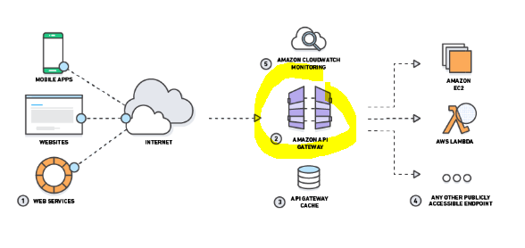

# API Gateway
Amazon API Gateway is an AWS service for creating, publishing, maintaining, monitoring, and securing REST and WebSocket APIs at any scale

## API Gateway in AWS deployment

### API Gateway can talk to:
- API Gateway can communicate to multiple backends
- Lambda functions
- AWS Step functions state machines
- HTTP endpoints exposed through Elastic Beanstalk, ELB or EC2 servers
- Non AWS hosted HTTP based operations accessible via public Internet
