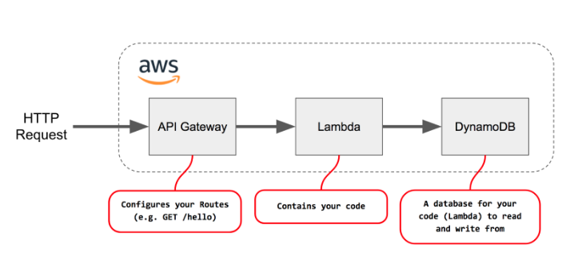

# Virtual Private Cloud
AWS Lambda lets you run code without provisioning or managing servers. You pay only for the compute time you consume - there is no charge when your code is not running.

## Lambda functions supports code written in
- Node.js (JavaScript)
- Python
- Java (Java 8 compatible)
- C# (.NET Core)
- Go

## Simple serverless architecture

