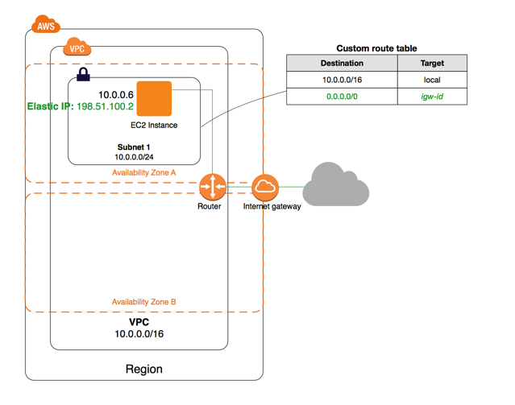
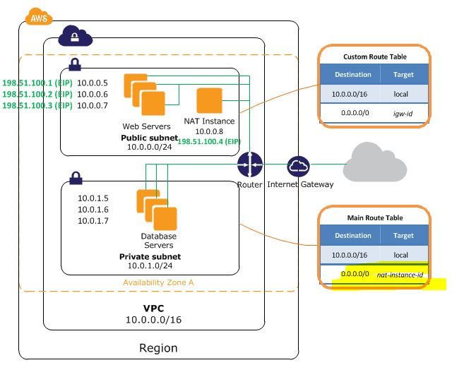

# Virtual Private Cloud
When create VPC default service that created are
* Main Route Table, 
* NACL,
* Security Group

## Scenario Single Public Subnet

## Scenario Single Public Subnet and Single Private Subnet
Private subnet use Main Route Table
Public subnet use Custom Route Table that has route to IG

